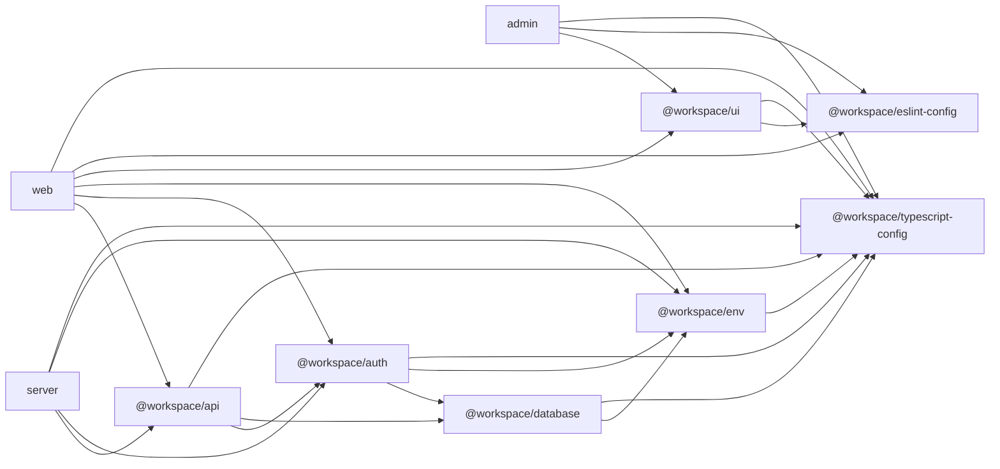
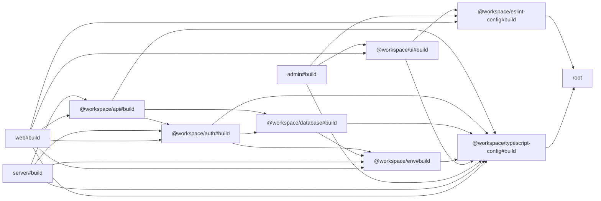

# Turborepo Graphs

## Workspace Dependency Graph



## Turbo Build Task Graph

This graph was generated from Turbo's `--graph` output for `turbo run build`.



## Refresh Commands

```bash
pnpm turbo run build --graph=graph.dot --dry=json
```

The package dependency graph is based on `workspace:*` relationships declared in the workspace `package.json` files.
